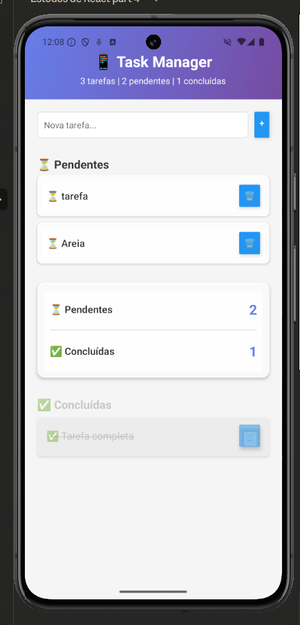

# 📱 Task Manager

Um gerenciador de tarefas moderno e intuitivo desenvolvido com React Native e Expo.

## 🎯 Sobre o Projeto

Aplicativo de lista de tarefas com interface moderna, separação visual entre tarefas pendentes e concluídas, e persistência de dados local.

## ✨ Features

- ✅ Criar, editar e deletar tarefas
- ⏳ Separação visual entre pendentes e concluídas
- 📊 Card com estatísticas em tempo real
- 🎨 Design moderno com gradiente
- 💾 Persistência de dados com AsyncStorage
- 📱 Interface responsiva e intuitiva

## 📸 Screenshot

<p align="center">
  
</p>

O app possui:
- ✅ Interface moderna com gradiente roxo/azul
- ⏳ Separação visual entre tarefas pendentes e concluídas
- 📊 Card divisor com estatísticas em tempo real
- 💾 Persistência de dados local com AsyncStorage

## 🚀 Tecnologias

- React Native
- Expo
- AsyncStorage (@react-native-async-storage/async-storage)
- Expo Linear Gradient
- JavaScript (ES6+)

## 🛠️ Como Rodar o Projeto

### Pré-requisitos

- Node.js instalado
- Expo CLI instalado (`npm install -g expo-cli`)
- Expo Go no celular (Android/iOS)

### Instalação

1. Clone o repositório
```bash
git clone https://github.com/Gus17ta/react-native-journey.git
```

2. Entre na pasta do projeto
```bash
cd react-native-journey
```

3. Instale as dependências
```bash
npm install
```

4. Rode o projeto
```bash
npx expo start
```

5. Escaneie o QR Code com o Expo Go no seu celular

## 📦 Dependências Principais
```json
"expo-linear-gradient": "~13.0.2",
"@react-native-async-storage/async-storage": "1.23.1"
```

## 🎨 Funcionalidades Detalhadas

### Header com Estatísticas
- Exibe total de tarefas
- Mostra quantidade de pendentes
- Mostra quantidade de concluídas

### Seção de Tarefas Pendentes
- Cards brancos com boa visibilidade
- Emoji ⏳ indicando status
- Texto em preto para destaque

### Card Divisor
- Resumo visual das tarefas
- Separação clara entre seções
- Design semi-transparente

### Seção de Tarefas Concluídas
- Opacidade reduzida (50%)
- Texto riscado
- Emoji ✅ indicando conclusão

## 👨‍💻 Desenvolvedor

Desenvolvido como parte do aprendizado de React Native e desenvolvimento mobile.

## 📄 Licença

Este projeto está sob a licença MIT.

---

⭐ Se este projeto te ajudou, considere dar uma estrela!